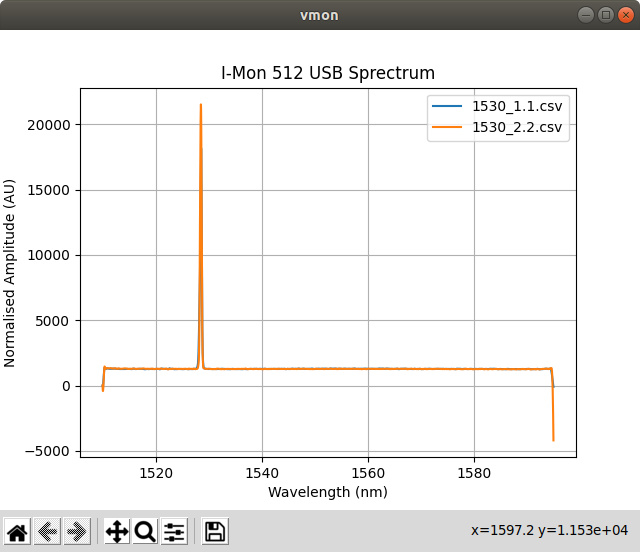
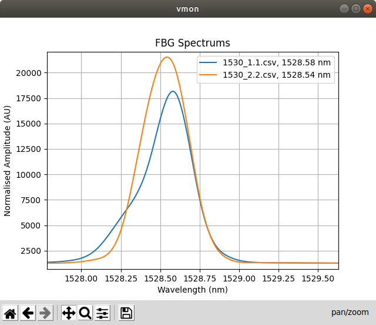

# vmon-cli

vmon-cli - CLI Viewer for Ibsen 512 USB interrogator


## Installation

- Install Using pip
```bash
    $ pip install vmon-cli
    $ pip install vmon-cli --no-cache
    Collecting vmon-cli
      Downloading vmon_cli-0.2.0-py3-none-any.whl (17 kB)
    Collecting Pillow==8.0.1
      Downloading Pillow-8.0.1-cp36-cp36m-manylinux1_x86_64.whl (2.2 MB)
         |████████████████████████████████| 2.2 MB 12.3 MB/s
    Requirement already satisfied: pyparsing==2.4.7 in /home/aananth/.virtualenvs/opencv/lib/python3.6/site-packages (from vmon-cli) (2.4.7)
    Collecting numpy==1.19.4
      Downloading numpy-1.19.4-cp36-cp36m-manylinux2010_x86_64.whl (14.5 MB)
         |████████████████████████████████| 14.5 MB 11.9 MB/s
    ...
```

- Install from Source
```bash
# clone the repository
$ git clone git@github.com:codenio/vmon-cli.git

# move into tmon-cli folder
$ cd vmon-cli

# install requirements
$ pip install -r requirments.txt

# intall tmon
$ pip install .

# check installation
$ vmon --help
Usage: vmon [OPTIONS] COMMAND [ARGS]...

  vmon - I-Mon Spectrum Viewer and Exporter

Options:
  --help  Show this message and exit.

Commands:
  export  Export Processed I-Mon data read from <file>.csv into...
  plot    Plot the I-Mon data into graphs
```

### Usage

- vmon commands
    ```bash
    vmon --help
    Usage: vmon [OPTIONS] COMMAND [ARGS]...

      vmon - I-Mon Spectrum Viewer and Exporter

    Options:
      --help  Show this message and exit.

    Commands:
      export  Export Processed I-Mon data read from <file>.csv into...
      plot    Plot the I-Mon data into graphs
    ```
- plot sub command
    ```bash
    $ vmon plot --help
	Usage: vmon plot [OPTIONS] FILES...

	  Plot the I-Mon data into graphs

	Options:
	  -p, --path TEXT   path form which csv files are to be imported, default = .
	  -t, --title TEXT  set custom title for the plot, default = .
	  -n, --normalise   normalise the data before ploting
	  -pk, --peaks      show peaks in the plot
	  --help            Show this message and exit.
    ```

- export sub command
    ```bash
    $ vmon export --help
    Usage: vmon export [OPTIONS] [FILES]...

      Export Processed I-Mon data read from <file>.csv into <file>_vmon.csv
      files

    Options:
      -p, --path TEXT  path form which csv files are to be imported, default = .
      -n, --normalise  normalise the data before ploting
      -i, --inspect    inspect the plot before exporting
      --help           Show this message and exit.
    ```

### Examples

- Plot Command
    ```bash
    $ vmon plot -p ./data/ 1530_1.1.csv 1530_2.2.csv
    ```
<p align="center">
  
</p>

- Plot Command with customised title, peaks and zoomed
	```bash
	$ vmon plot -p ./data/ 1530_1.1.csv 1530_2.2.csv -pk -t "FBG Spectrums"
	```

<p align="center">
  
</p>

- Export Command
    ```bash
    $ ls data/
    1530_1.1.csv  1530_2.2.csv
    $ vmon export -p ./data/ 1530_1.1.csv 1530_2.2.csv
    ls data/
    1530_1.1.csv  1530_1_vmon.csv  1530_2.2.csv  1530_2_vmon.csv
    $ head data/1530_1_vmon.csv
    Wavelength (nm),Amplitude (AU)
    1510.0,0.0
    1510.001,-4.46409379834189
    1510.002,-8.822075456896682
    1510.003,-13.074451526489682
    1510.004,-17.221728557946186
    1510.0049999999999,-21.264413102091495
    1510.0059999999999,-25.20301170975091
    1510.0069999999998,-29.03803093174973
    1510.0079999999998,-32.769977318913256
    ```
